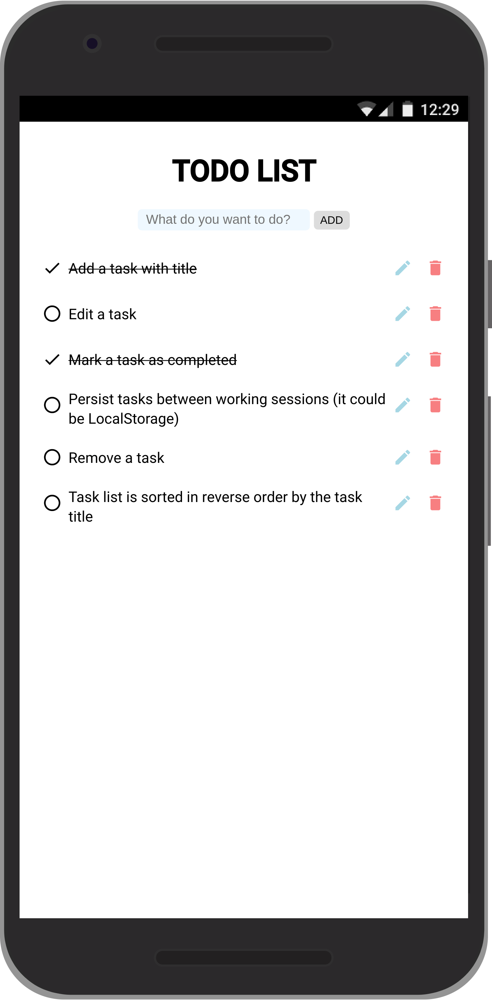
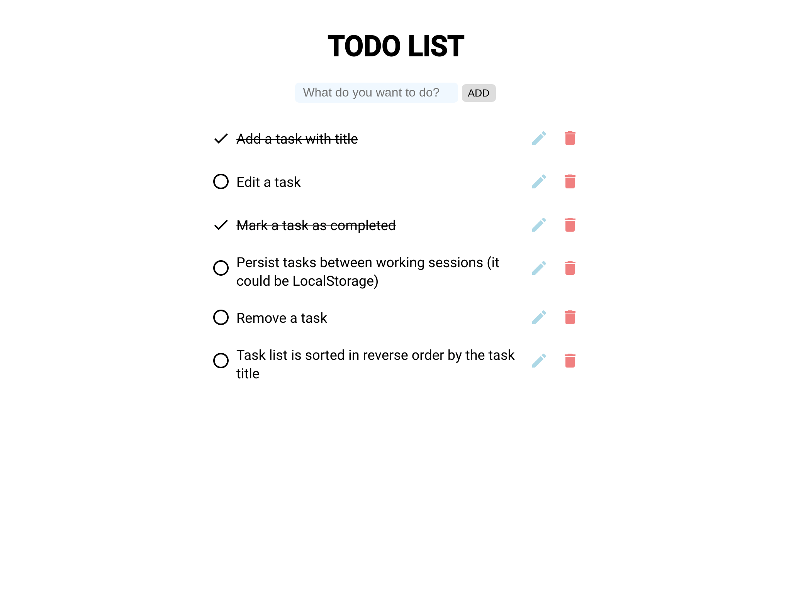

This is simple TODO LIST

## Mobile

## Desktop

## Description

The Application should provide the following functionality:
- Add a task with title
- Task list is sorted in reverse order by the task title
- Edit a task
- Mark a task as completed
- Remove a task
- Persist tasks between working sessions (it could be LocalStorage)

## Create React App

This project was bootstrapped with [Create React App](https://github.com/facebook/create-react-app).

## Available Scripts

In the project directory, you can run:

### `npm start`

Runs the app in the development mode. 
Open [http://localhost:3000](http://localhost:3000) to view it in the browser.
